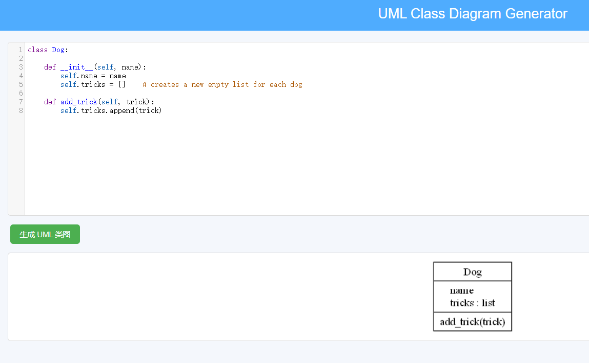

# Scrum Project Management and Python IDE

This is the course project of Group "Course Project 24" for the CityU CS5351 24Fall.

Our platform integrates an online Python Web Editor with task management tools to facilitate software development and collaboration. The platform features a robust Python coding environment, task-tracking capabilities, and software quality analysis tools.

---


## **Features**

### Core Features
1. **User Authentication System**:  
   - Provides secure login functionality using a database for credential storage.
   - Users have dedicated workspaces for managing their Python projects.

2. **Syntax Highlighting**:  
   - Implements real-time syntax highlighting for Python code.
   - Utilizes the CodeMirror library to improve code readability by distinguishing functions, variables, strings, and keywords.

3. **Code Auto-Completion**:  
   - Enhances coding efficiency with intelligent suggestions for Python functions, keywords, and user-defined entities.
   - Integrates a customized CodeMirror solution for context-aware suggestions.

4. **Code Error Detection**:  
   - Highlights potential errors in Python code using an edit-distance algorithm.
   - Identifies and underlines possible misspellings in Python keywords or user-defined entities.

5. **Code Execution**:  
   - Enables users to run Python scripts directly on the server.
   - Captures output and error streams for real-time feedback displayed in the UI.

6. **Flowchart Generation**:  
   - Converts Python code into flowcharts to visualize execution logic.
   - Uses `pyflowchart` and external rendering libraries to create interactive diagrams.

7. **Scrum Board**:  
   - Implements a task management system modeled after Agile principles.  
   - Features include:  
     - Task creation, assignment, and progress tracking.
     - Visualization of team velocity and sprint goals.  
   - Facilitates efficient project tracking and collaboration.  
   - **Module**: `scrum_board.py`

8. **Pylint Code Review**:  
   - Integrates static code analysis to ensure code quality and adherence to Python best practices.  
   - Reports on style issues, potential bugs, and optimization suggestions.  
   - **Module**: `pylint.py`

9. **UML Diagram Generation**:  
   - Automatically generates UML class diagrams from Python codebases.  
   - Provides insights into the structure and design of the application.  
   - Utilizes `pyreverse` and `Graphviz` for rendering diagrams.  
   - **Module**: `uml_diagram.py`

---

## **Project Structure**

### Backend Modules
- **main.py**: Main Flask application controller.  
- **user_login.py**: Handles user authentication and session management.  
- **run_code.py**: Executes Python code and manages related functionalities.  
- **flowchart.py**: Implements flowchart generation.  
- **scrum_board.py**: Manages Scrum board features for task tracking and sprints.  
- **pylint.py**: Provides static code analysis using Pylint.  
- **uml_diagram.py**: Facilitates UML diagram generation.  
- **DBdebug.py**: Manages debugging operations for the database.

### Frontend and Assets
- **static/**:  
  - Contains CSS files for styling and JavaScript for syntax highlighting and auto-completion.  
  - Includes assets for Scrum board interaction and UML visualization.

- **templates/**:  
  - HTML templates for the editor, login interface, and Scrum board.  

### Database
- **users.db**: SQLite database for storing user credentials and project metadata.  
- **work/**: Directory for individual user workspaces.

---

## **Technology Stack**

- **Backend Framework**: Flask  
- **Frontend Library**: CodeMirror  
- **Database**: SQLite  
- **Visualization Tools**:  
  - `pyflowchart` (Flowchart generation)  
  - `pyreverse` and `Graphviz` (UML diagrams)  
- **Code Quality**: Pylint  

---

## **Getting Started**

1. **Install Required Dependencies**:  
   ```bash
   pip install flask pyflowchart pylint pyreverse
   sudo apt-get install graphviz
   ```
   Put static and templates in the frontend directory

2.**Run the Server**:
   ```bash
   python main.py
   ```

3.**Access the Platform**:
Open a browser and navigate to local host.

4.**Login or Register**:
For new users, register an account.
Test accounts:
user: Alice           password: 12345
user: G24             password: 12345

5.**Features Navigation**:
Editor Page: Includes a file browser (left), code editor (right), and output panel (bottom).
Buttons for actions like "New", "Save", "Run", "Flowchart", "UML Class".
Scrum Board: Accessible from the main menu for task management.

## Example Outputs
1.**Prime Numbers Code Output**:
Test Code: Generates prime numbers between 1 and 100.

2.**Flowchart Example**:

3.**UML Diagram Example**:

4.**Scrum Board Example**:

5.**Pylint Code Review**:


## Future Development Goals
Enhance collaboration features, such as real-time editing and task assignment notifications.
Expand UML diagram support for additional diagram types.
Introduce additional Scrum metrics like burn-down charts and capacity planning.

